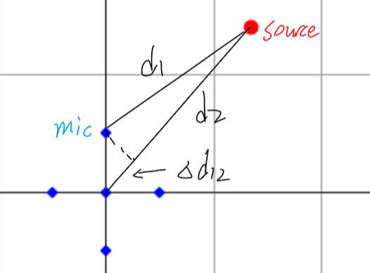
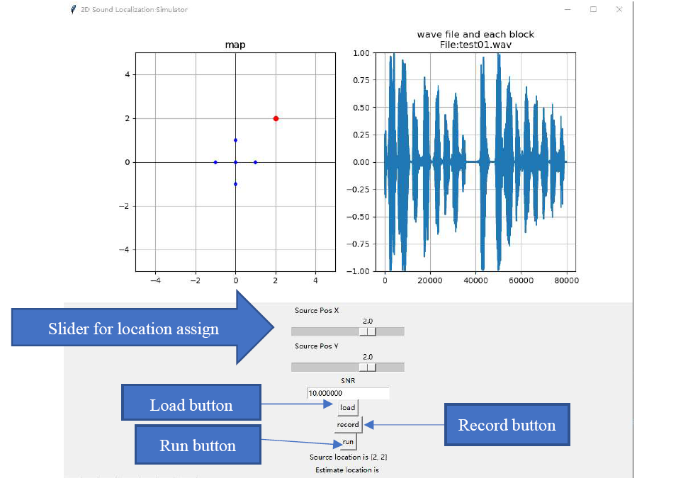
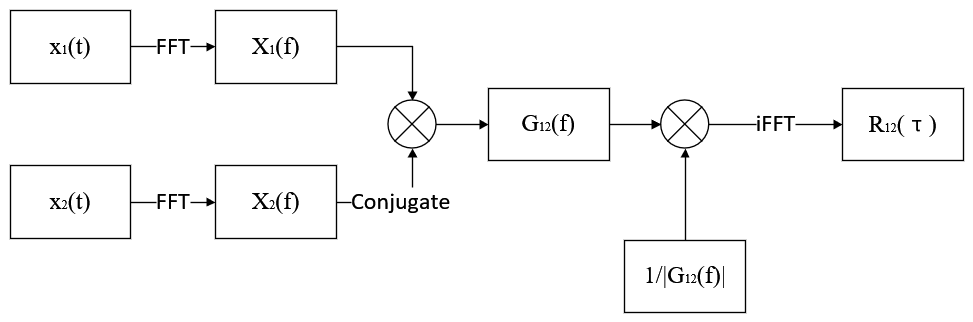
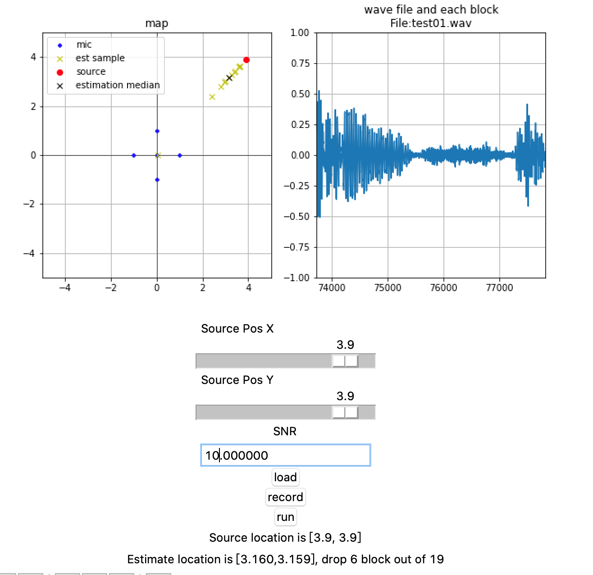
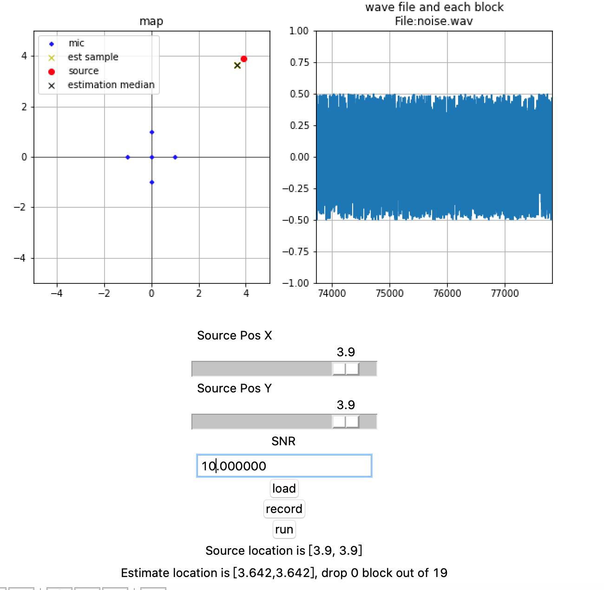

# Real Time 2D Sound Localization Simulation
Project for DSP Lab(ECE-GY 6183)

by chengfeng luo, yuan sha

## Introduction
In this project, we tried to estimate the location of the sound source related to a 5-element microphone array in the near-field space. Our idea is first estimating the source distance difference between microphones, for example $∆d_{12}$ in figure below, using the property of correlation between each channel.
 
For the second step, we can use the distance difference data to calculate the source position based on the configuration of the microphone array.

In the first part, we used the gcc-phat algorithm and the mathematical relocation method based on relative delay time is used in second part.

## GUI
 

## Algorithms
 1. Data Generation
  For the distance between each microphone and source is difference, the waveform received by each microphone channel will be delayed respected to the distance. For source signal $s(t)$, the received signal in channel i can be modeled as:
$$
mic_i (t)=s(t-∆τ_i )+n_i (t)
$$
where $∆τ_i=\frac{distance to source}{sound speed}$, $n_i (t)$ is uncorrelated Gaussian noise.
	To generate such data, we first implement the delay using linear interpolation method, than add Gaussian noise to each channel. The SNR can be configured through GUI.
 2. Delay Estimation
 We used GCC-PATH for estimated the delay between each channel. The block diagram of GCC-PATH can be show as:
 
 For the delay value needs to be estimated from the correlation spectrum(output of GCC-PATH), Quinn’s interpolation method is used for accuracy improvement.
  3. Source Localization
  See the report PDF for more details.

## Result
Below showed the simulation result based on human voice audio.
 

If we use white noise for the audio input, we will have a much better estimation:
 
